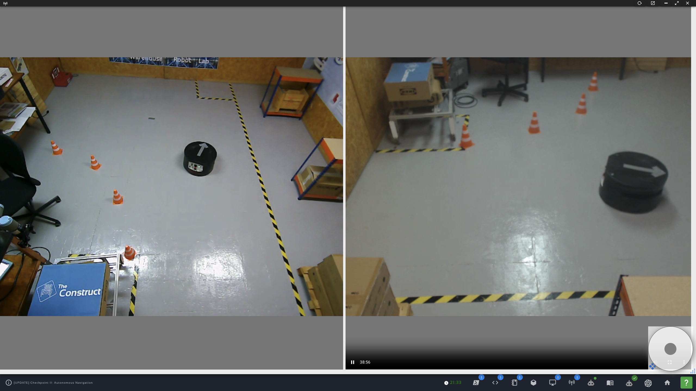
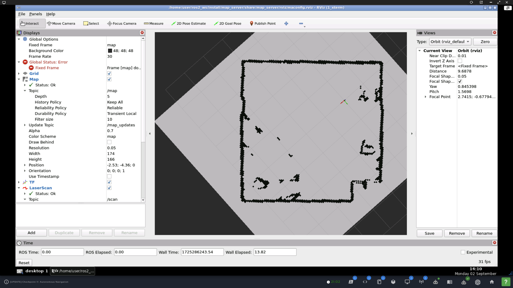
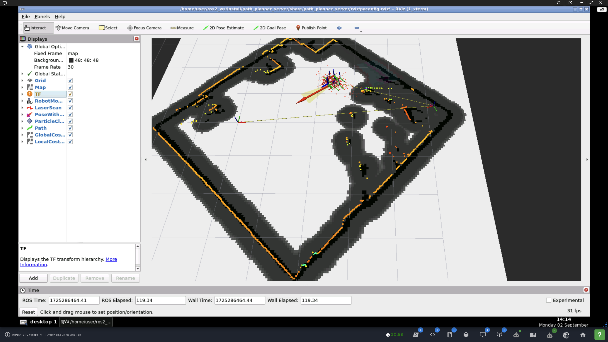
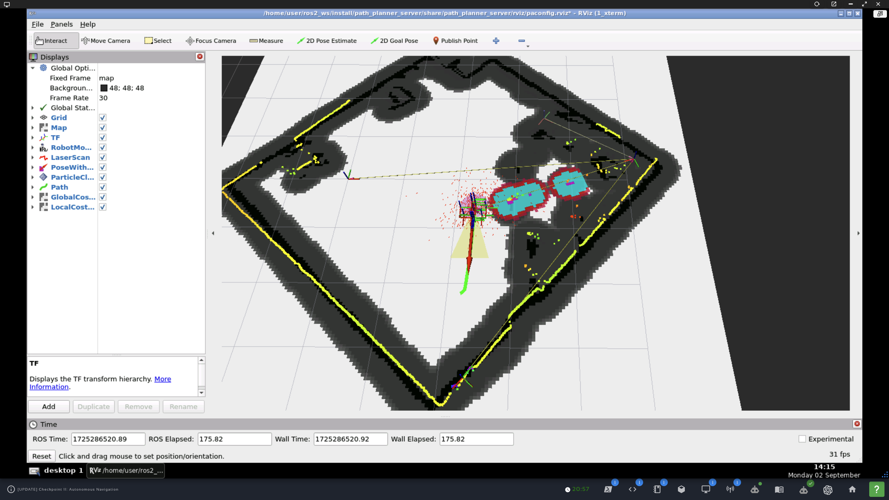

### `warehouse_project`

#### Overview

Robot navigation around a simulated and real lab space with the [Robotnik RB1-Base](https://robotnik.eu/products/mobile-robots/rb-1-base/) robot. Lab space courtesy of The Construct.  



#### Submission notes

1. Launching
   1. Preliminaries
      ```
      cd ~/ros2_ws/src
      git clone https://github.com/ivogeorg/warehouse_project.git
      git checkout path-planning
      cd ~/ros2_ws
      rm -fr build install log 
      colcon build --clean
      source install/setup.bash
      ```
   2. The `use_sim_time` argument:
      1. **All launch files declare the argument `use_sim_time`**.
      2. It controls the `'use_sim_time'` node parameter.
      3. It also controls which config files the nodes will use, for the simulator (`use_sim_time:=true`) or the real-robot lab (`use_sim_time:=false`) environment.
      4. The default is `true`, that is, for the **simulator** environment. For the **lab**, please add `use_sim_time:=false` to the launch on the command line.
   3. Cartographer SLAM
      ```
      cd ~/ros2_ws
      source install/setup.bash
      ros2 launch cartographer_slam cartographer.launch.py
      ```
   4. Map server
      ```
      cd ~/ros2_ws
      source install/setup.bash
      ros2 launch map_server map_server.launch.py map_file:=warehouse_map_real.yaml
      ```
   5. Localization server
      ```
      cd ~/ros2_ws
      source install/setup.bash
      ros2 launch localization_server localization.launch.py map_file:=warehouse_map_real.yaml
      ```
   6. Navigation (aka Path planner server)
      ```
      cd ~/ros2_ws
      source install/setup.bash
      ros2 launch path_planner_server navigation.launch.py map_file:=warehouse_map_real.yaml
      ```
2. Notes
   1. The working implementation is on the branch `path-planning`. Please, do `git checkout` before building and running.
   2. Each of the launches includes an Rviz2 node configured for it.
   3. The Path Planner Server has an integraged launch file called `navigation.launch.py` which includes the `map_server`, `amcl`, `planner_server`, `controller_server`, `behavior_server`, and `bt_navigator` node, along with a lifecycle manager node.
   4. All launches are auto-configured for the simulator or the lab depending on the value of the `use_sim_time` argument.
   5. The robot description topic `/robot_description` to which the **Robot Model** item is set in Rviz2 does no longer have a publisher shortly after launch. I suppose that the publisher has broadcast it with _high durability_ and then exited.
   6. The width of the local costmap has been increased to 2 m by the rule-of-thumb for 4x the size of the robot. The diameter of RB1 is 0.5 m.
3. Expected results (lab only shown)
   1. Map server
        
   2. Localization server
        
   3. Navigation (aka Path planner server)
        


