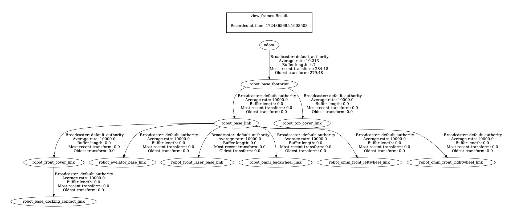
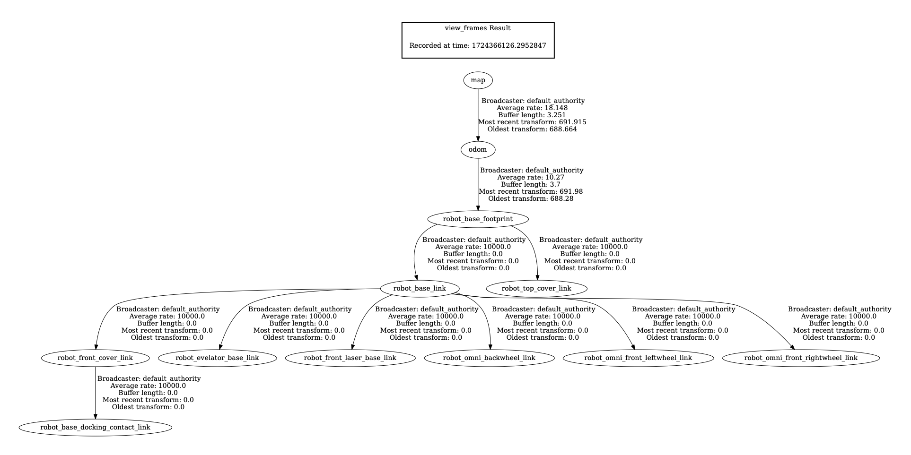

### `cartographer_slam`

#### Implementation notes

1. The `occupancy_grid_node` has to be renamed to `cartographer_occupancy_grid_node` in the [launch file](launch/cartographer.launch.py).
   ```
   user:~/ros2_ws/src/warehouse_project$ ros2 run cartographer_ros
   --prefix                             cartographer_occupancy_grid_node     cartographer_pbstream_to_ros_map
   cartographer_assets_writer           cartographer_offline_node            cartographer_rosbag_validate
   cartographer_node                    cartographer_pbstream_map_publisher
   ```
2. The `occupancy_grid_node` publishes the `/map` topic as well as the `/map`->`/odom` transform. Despite the name change in the previous point, `ros2 topic info /map -f` reports the publisher as `occupancy_grid_node`.
   | Before | After |
   | --- | --- |
   |  |  | 
3. The `tracking_frame` parameter in the [Lua config file](config/cartographer.lua) needs to be changed to `robot_base_footprint`.
