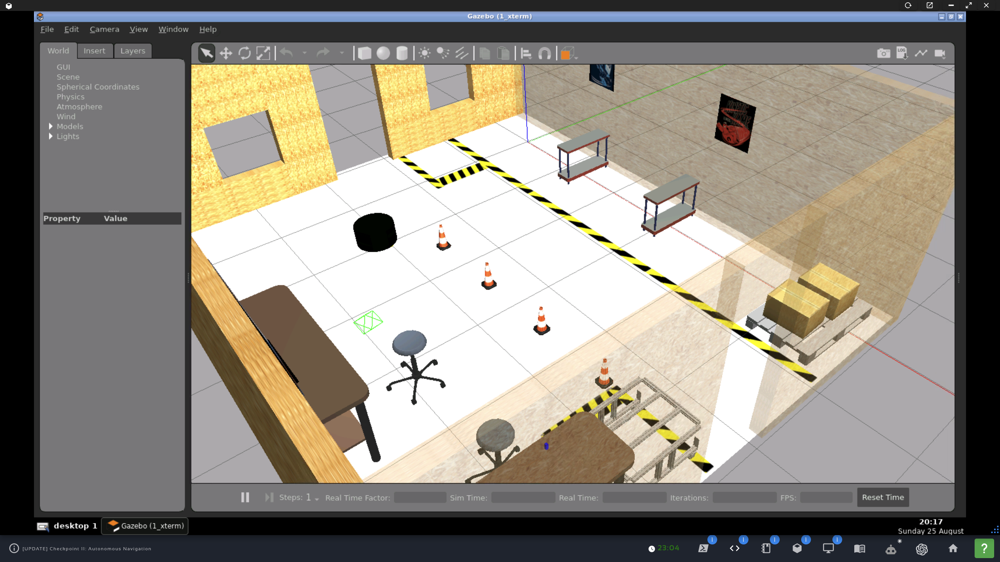
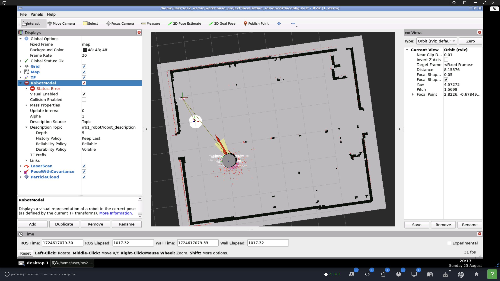

### `localization_server`

Part of [`warehouse_project`](https://github.com/ivogeorg/warehouse_project.git).

#### Localization in simulator (Gazebo)

Launch simulator:  
```
user:~$ source sim_ws/install/setup.bash
user:~$ ros2 launch the_construct_office_gazebo warehouse_rb1.launch.xml
```  

Result:  
| Gazebo | Rviz2 |
| --- | --- |
|  |  |   

#### TODO

1. A map parameter `map_file`, to differentiate between simulator and real-robot lab maps.
   1. This parameter only provides the filename.
   2. The `nav2_...` package parameter requires the full path to the map.
   3. Will require _substitutions_ as used in this [launch file](https://github.com/ivogeorg/attach_shelf/blob/b511e89921b100bcaad62dd5f4291d8397f8be35/launch/attach_to_shelf.launch.py#L11).
2. The maps should not be copied from one stage to another. They should be sourced from the `map_server`, the package that generated them.

#### Implementation notes

1. [SOLVED] Error on bringup:
```
[lifecycle_manager-3] [INFO] [1724457263.335873652] [lifecycle_manager_mapper]: Configuring map_server
[map_server-1] [INFO] [1724457263.336073807] [map_server]:
[map_server-1]  map_server lifecycle node launched.
[map_server-1]  Waiting on external lifecycle transitions to activate
[map_server-1]  See https://design.ros2.org/articles/node_lifecycle.html for more information.
[map_server-1] [INFO] [1724457263.336201255] [map_server]: Creating
[map_server-1] [INFO] [1724457263.336630204] [map_server]: Configuring
[map_server-1] [ERROR] [1724457263.336693035] [map_server]: Caught exception in callback for transition 10
[map_server-1] [ERROR] [1724457263.336708227] [map_server]: Original error: parameter 'yaml_filename' is not initialized
[map_server-1] [WARN] [1724457263.336724888] [map_server]: Error occurred while doing error handling.
[map_server-1] [FATAL] [1724457263.336734366] [map_server]: Lifecycle node map_server does not have error state implemented
[lifecycle_manager-3] [ERROR] [1724457263.337108773] [lifecycle_manager_mapper]: Failed to change state for node: map_server
[lifecycle_manager-3] [ERROR] [1724457263.337134674] [lifecycle_manager_mapper]: Failed to bring up all requested nodes. Aborting bringup.
```

**Solution:** Needed a refresh by `rm -fr build install log; colcon build`.

2. [SOLVED] Error with [AMCL configuration](https://docs.nav2.org/configuration/packages/configuring-amcl.html#example):
```
[lifecycle_manager-3] [INFO] [1724615575.030947036] [lifecycle_manager_mapper]: Configuring amcl
[amcl-2] [INFO] [1724615575.031221940] [amcl]: Configuring
[amcl-2] [INFO] [1724615575.031313861] [amcl]: initTransforms
[amcl-2] [INFO] [1724615575.044033271] [amcl]: initPubSub
[amcl-2] [INFO] [1724615575.282229679] [amcl]: Subscribed to map topic.
[amcl-2] [ERROR] [1724615575.284601286] [amcl]: Caught exception in callback for transition 10
[amcl-2] [ERROR] [1724615575.284700159] [amcl]: Original error: According to the loaded plugin descriptions the class differential with base class type nav2_amcl::MotionModel does not exist. Declared types are  nav2_amcl::DifferentialMotionModel nav2_amcl::OmniMotionModel
[amcl-2] [WARN] [1724615575.284738873] [amcl]: Error occurred while doing error handling.
[amcl-2] [FATAL] [1724615575.284757296] [amcl]: Lifecycle node amcl does not have error state implemented
[lifecycle_manager-3] [ERROR] [1724615575.286595554] [lifecycle_manager_mapper]: Failed to change state for node: amcl
[lifecycle_manager-3] [ERROR] [1724615575.286644592] [lifecycle_manager_mapper]: Failed to bring up all requested nodes. Aborting bringup.
```

**Solution:** Changed in AMCL config file: `robot_model_type: "nav2_amcl::OmniMotionModel"`.

3. [SOLVED] Error in AMCL config:
```
[amcl-2] [ERROR] [1724616580.686164580] [amcl]: Couldn't transform from robot_front_laser_base_link to base_footprint, even though the message notifier is in use: ("base_footprint" passed to lookupTransform argument target_frame does not exist. )
[amcl-2] [INFO] [1724616580.686328613] [amcl]: createLaserObject
```

**Solution:** Changed in AMCL config file: `    base_frame_id: "robot_base_footprint"`

