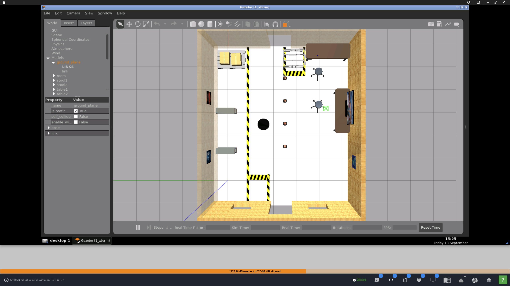
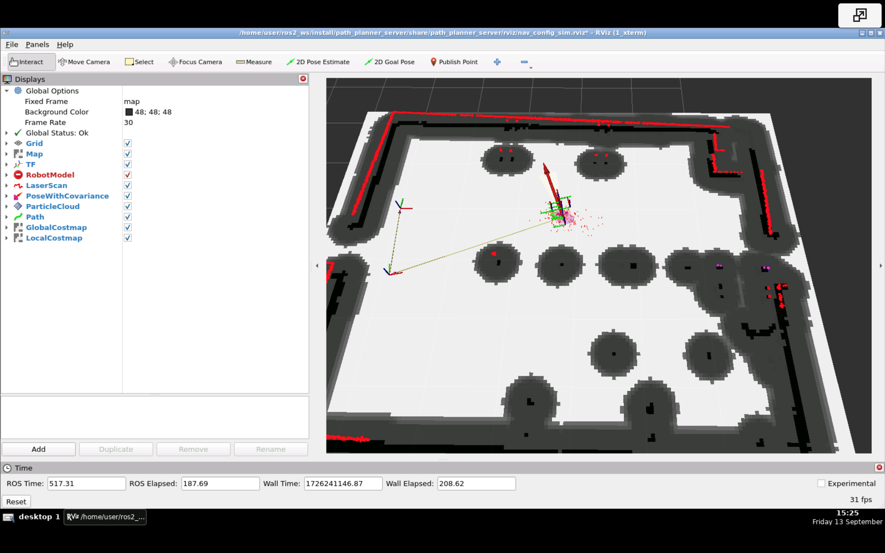
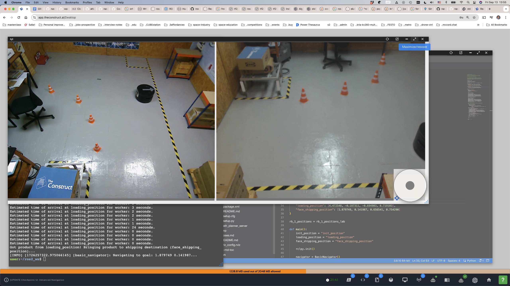
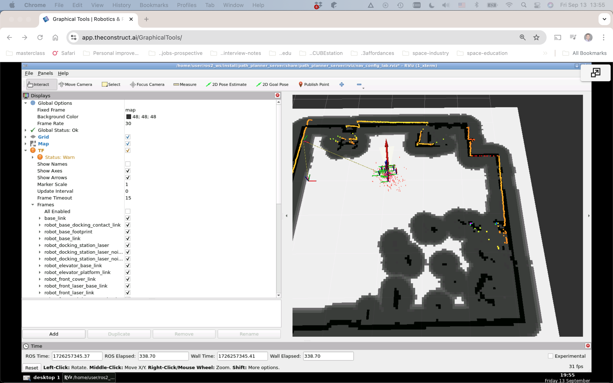

### nav2_apps

Using `BasicNavigator` to move RB-1 to the loading area, pick up the cart, take it to the shipping area, and return to its initial position.

#### Implementation notes

A series of experiements.  

##### 1. Simple `BasicNavigator.goToPose`

Using `BasicNavigator.goToPose` to move from `init_position` to `loading_position` and then to `face_shipping_position`.  

| Gazebo (sim) | Rviz2 |
| --- | --- |
|  |  |  

Notes:
1. The rotations for both poses `laoding_position` and `face_shipping_position` are **incomplete**.
2. The non-nav services `cart_pick_up` and `cart_set_down` should ensure proper heading.

| Lab (real robot) | Rviz2 |
| --- | --- |
|  |  |  

