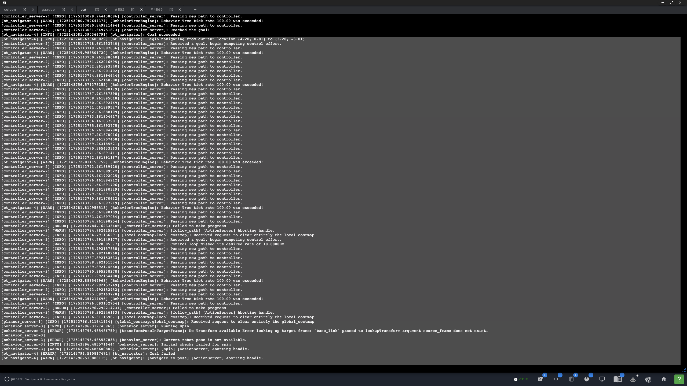
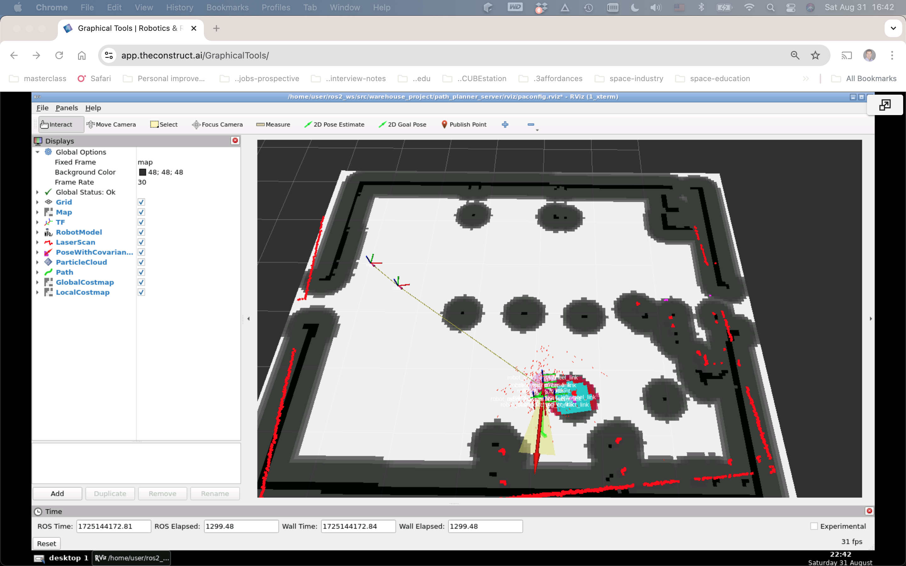
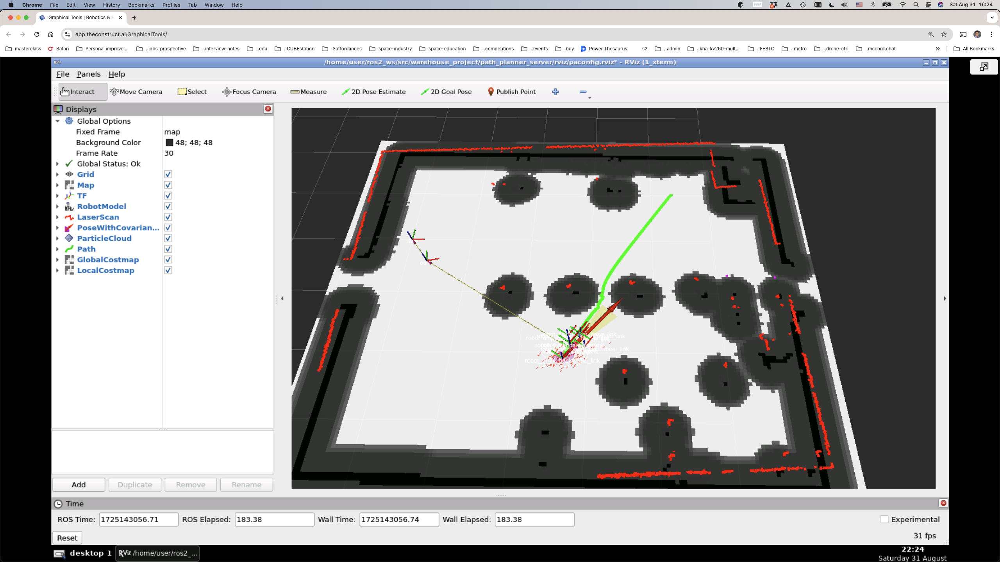
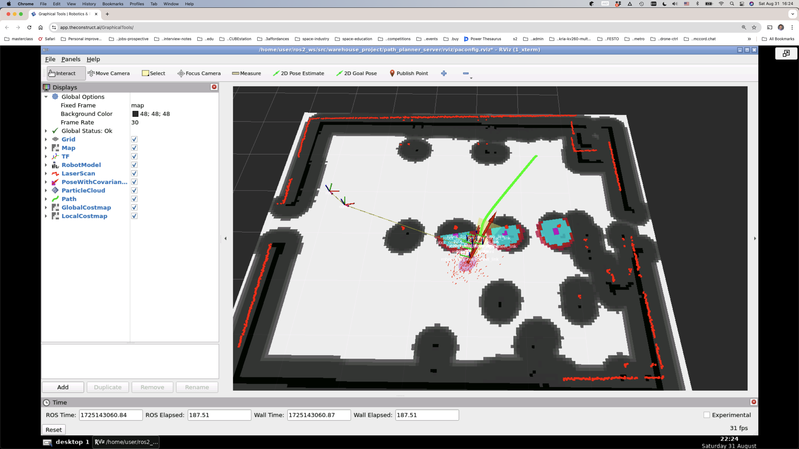
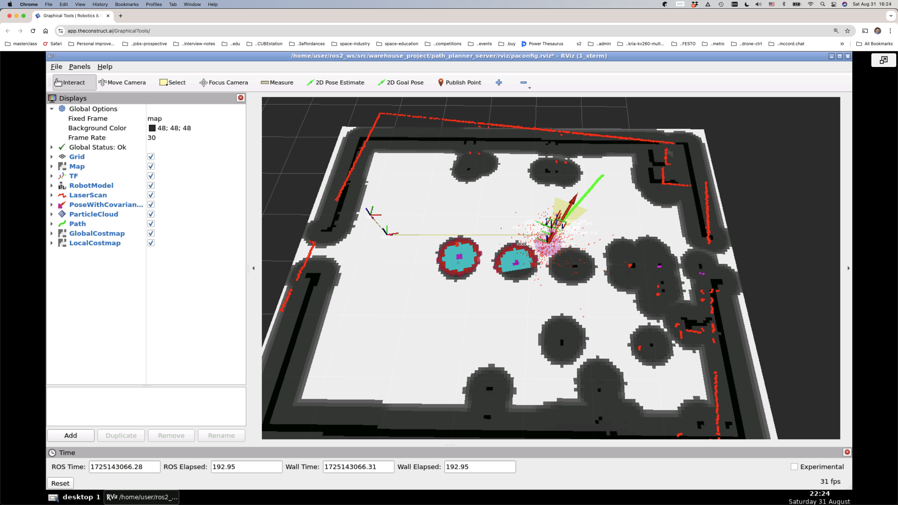
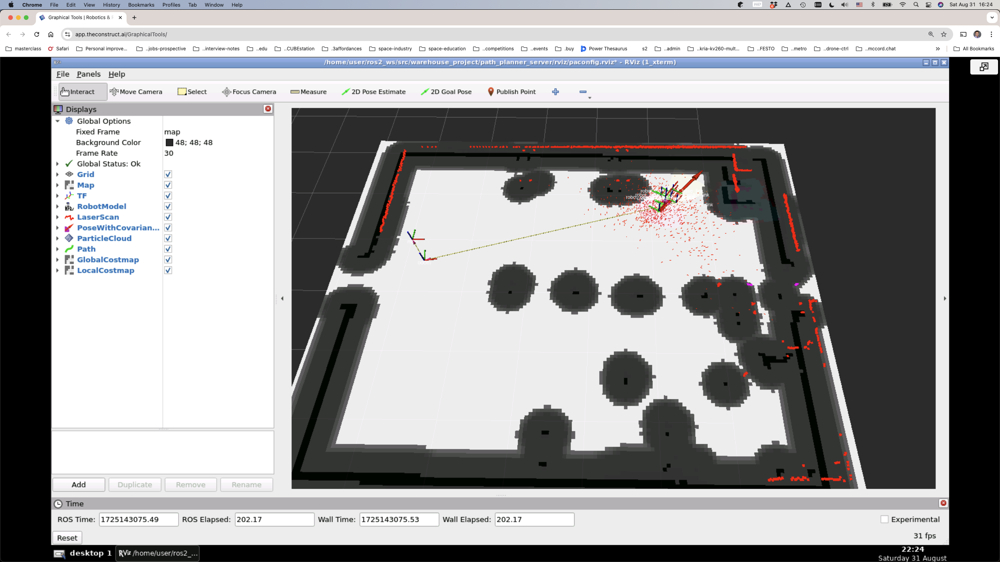

### `path_planner_server`

#### Implementation notes

##### Error 1

Error on launch of recoveries server:
```
[ERROR] [launch]: Caught exception in launch (see debug for traceback): "package 'nav2_recoveries' not found, searching: ...
```

##### _Solution - Error 1_

1. Package name is `nav2_behaviors`
2. Executable is `behavior_server`
3. Recoveries are behaviors now (in yaml config file):
   ```
   recovery_plugins: ["spin", "backup", "wait"]
   spin:
     plugin: "nav2_behaviors/Spin"
   backup:
     plugin: "nav2_behaviors/BackUp"
   wait:
     plugin: "nav2_behaviors/Wait"
   ```
4. Note that in [`pathplanner.launch.py`](path_planner_server/launch/pathplanner.launch.py) the behavior node is `behavior_server` (executable and name the same) from package `nav2_behaviors`, but the config file [`behavior.yaml`](path_planner_server/config/behavior.yaml) starts with `recoveries_server`!

##### Error 2

Error in path planning:
1. The two wheel links are not in the TF tree in Rviz2 but don't appear in the Gazebo model either.
2. A **2D Goal Pose** does not trigger a path planning process although the pose is reported in the Rviz2 stdout log. 
3. The path planner launch reports:
   ```
   [planner_server-1] [INFO] [1724650892.070262338] [global_costmap.global_costmap]: Timed out waiting for transform from base_link to map to become available, tf error: Invalid frame ID "base_link" passed to canTransform argument source_frame - frame does not exist
   ```
4. Toggling `robot_model_type: "nav2_amcl::DifferentialMotionModel" # "nav2_amcl::OmniMotionModel"` has no effect on these problems.
5. Gazebo world, robot spawning, and controller initialization don't report any errors.
6. Causes failure during final approach to a difficult goal, specifically attempting "recovery" behaviors:
   | Log | Rviz2 |
   | --- | --- |
   |  |  |


##### Successful path planning

###### Rviz2

| Rviz2 |
| --- |
|  |
|  |
|  |
|  |
   
###### Nodes

```
user:~$ ros2 node list
/amcl
/attach_cart_node
/behavior_server
/bt_navigator
/bt_navigator_navigate_through_poses_rclcpp_node
/bt_navigator_navigate_to_pose_rclcpp_node
/cmd_vel_relay
/controller_manager
/controller_server
/demo/gazebo_ros_state
/diffbot_base_controller
/elevator_relay
/gazebo
/gazebo_ros2_control
/global_costmap/global_costmap
/joint_state_broadcaster
/lifecycle_manager_mapper
/lifecycle_manager_pathplanner
/local_costmap/local_costmap
/map_server
/odom_relay
/planner_server
/position_controller
/rb1_robot/robot_state_publisher
/rviz
/scan
/transform_listener_impl_5573495f6210
/transform_listener_impl_55818ff457e0
/transform_listener_impl_55b7f9f56a70
/transform_listener_impl_55c1bf922d70
/transform_listener_impl_55db0e600830
```

###### Topics

```
user:~$ ros2 topic list
/amcl/transition_event
/amcl_pose
/behavior_server/transition_event
/behavior_tree_log
/bond
/bt_navigator/transition_event
/clicked_point
/clock
/cmd_vel
/controller_server/transition_event
/cost_cloud
/demo/link_states_demo
/demo/model_states_demo
/diagnostics
/diffbot_base_controller/cmd_vel_unstamped
/diffbot_base_controller/odom
/diffbot_base_controller/transition_event
/dynamic_joint_states
/elevator_down
/elevator_up
/evaluation
/global_costmap/costmap
/global_costmap/costmap_raw
/global_costmap/costmap_updates
/global_costmap/footprint
/global_costmap/global_costmap/transition_event
/global_costmap/published_footprint
/goal_pose
/initialpose
/joint_state_broadcaster/transition_event
/joint_states
/local_costmap/clearing_endpoints
/local_costmap/costmap
/local_costmap/costmap_raw
/local_costmap/costmap_updates
/local_costmap/footprint
/local_costmap/local_costmap/transition_event
/local_costmap/published_footprint
/local_costmap/voxel_grid
/local_plan
/map
/map_server/transition_event
/map_updates
/marker
/odom
/parameter_events
/particle_cloud
/performance_metrics
/plan
/planner_server/transition_event
/position_controller/commands
/position_controller/transition_event
/rb1_robot/joint_states
/rb1_robot/robot_description
/received_global_plan
/robot_description
/rosout
/scan
/speed_limit
/tf
/tf_static
/transformed_global_plan
```

###### Frames

```
user:~/ros2_ws/src/warehouse_project/path_planner_server/test$ more frames_2024-08-31_22.55.19.gv
digraph G {
"robot_front_cover_link" -> "robot_base_docking_contact_link"[label=" Broadcaster: default_authority\nAverage rate: 10000.0\nBuffer length: 0.0\nMost recent transform: 0.0\nOldest transform: 0.0\n"];
"robot_base_link" -> "robot_front_cover_link"[label=" Broadcaster: default_authority\nAverage rate: 10000.0\nBuffer length: 0.0\nMost recent transform: 0.0\nOldest transform: 0.0\n"];
"robot_base_footprint" -> "robot_base_link"[label=" Broadcaster: default_authority\nAverage rate: 10000.0\nBuffer length: 0.0\nMost recent transform: 0.0\nOldest transform: 0.0\n"];
"odom" -> "robot_base_footprint"[label=" Broadcaster: default_authority\nAverage rate: 10.222\nBuffer length: 4.5\nMost recent transform: 2178.8\nOldest transform: 2174.3\n"];
"robot_base_link" -> "robot_evelator_base_link"[label=" Broadcaster: default_authority\nAverage rate: 10000.0\nBuffer length: 0.0\nMost recent transform: 0.0\nOldest transform: 0.0\n"];
"robot_base_link" -> "robot_front_laser_base_link"[label=" Broadcaster: default_authority\nAverage rate: 10000.0\nBuffer length: 0.0\nMost recent transform: 0.0\nOldest transform: 0.0\n"];
"robot_base_link" -> "robot_omni_backwheel_link"[label=" Broadcaster: default_authority\nAverage rate: 10000.0\nBuffer length: 0.0\nMost recent transform: 0.0\nOldest transform: 0.0\n"];
"robot_base_link" -> "robot_omni_front_leftwheel_link"[label=" Broadcaster: default_authority\nAverage rate: 10000.0\nBuffer length: 0.0\nMost recent transform: 0.0\nOldest transform: 0.0\n"];
"robot_base_link" -> "robot_omni_front_rightwheel_link"[label=" Broadcaster: default_authority\nAverage rate: 10000.0\nBuffer length: 0.0\nMost recent transform: 0.0\nOldest transform: 0.0\n"];
"robot_base_footprint" -> "robot_top_cover_link"[label=" Broadcaster: default_authority\nAverage rate: 10000.0\nBuffer length: 0.0\nMost recent transform: 0.0\nOldest transform: 0.0\n"];
"map" -> "odom"[label=" Broadcaster: default_authority\nAverage rate: 20.193\nBuffer length: 4.556\nMost recent transform: 2179.782\nOldest transform: 2175.226\n"];
edge [style=invis];
 subgraph cluster_legend { style=bold; color=black; label ="view_frames Result";
"Recorded at time: 1725144919.6864219"[ shape=plaintext ] ;
}->"map";
}
```

###### Miscellaneous configuration

1. Robot Model Description Topic: `/robot_description`. ROS2 doesn't report any publisher! Same with `/rb1_robot/robot_description`.
2. The 3 missing frames don't appear at all.

```
