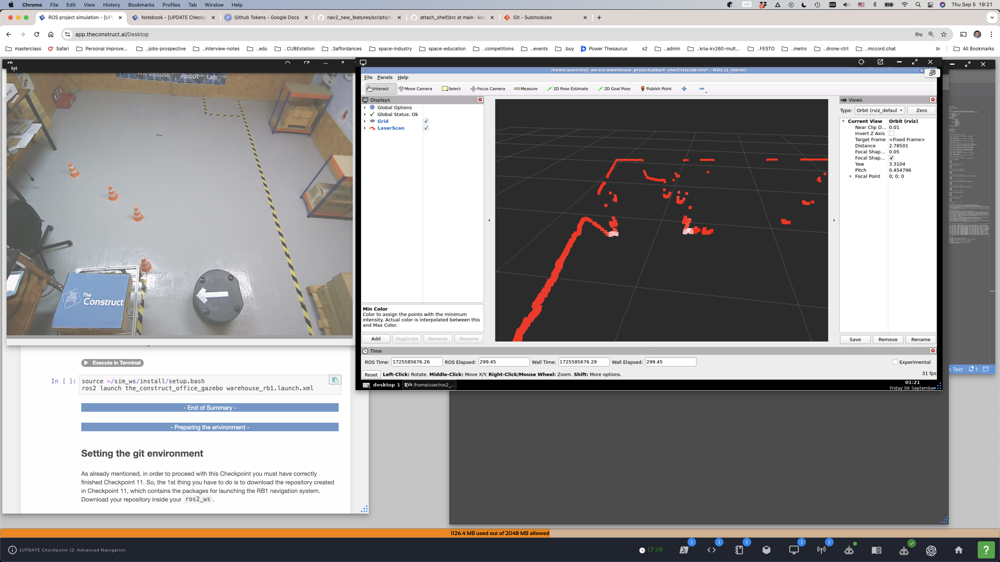

### Checkpoint 12 Data

#### `PoseWithCovarianceStamped`

1. Description
```
user:~$ ros2 interface show geometry_msgs/msg/PoseWithCovarianceStamped
# This expresses an estimated pose with a reference coordinate frame and timestamp

std_msgs/Header header
        builtin_interfaces/Time stamp
                int32 sec
                uint32 nanosec
        string frame_id
PoseWithCovariance pose
        Pose pose
                Point position
                        float64 x
                        float64 y
                        float64 z
                Quaternion orientation
                        float64 x 0
                        float64 y 0
                        float64 z 0
                        float64 w 1
        float64[36] covariance
```

2. Indices:
   1. `covariance[0]` - x
   2. `covariance[7]` - y
   3. `covariance[35]` - z

3. Tolerance [0.025, 0.1]


#### 1. Simulator poses (relative to `map` frame)

Format: `[pos_x, pos_y, ori_z, ori_w]`  

1. Initial pose (`init_position`)
[0.0400, 0.1121, 0.0850, 0.9964] 

2. Loading pose (`loading_position`)
[5.5888, -0.0618, -0.7192, 0.6948]  

7. face-shipping _(facing the shipping pose)_
[2.4501, -0.1236, 0.7494, 0.6621]

8. Shipping pose (`shipping_position`)
[2.5062, 1.3838, 0.6914, 0.7225]

#### 2. Lab poses (relative to `map` frame)

Format: `[pos_x, pos_y, ori_z, ori_w]`  

1. Initial pose (`init_position`)
[0.0272, 0.1311, -0.0099, 1.0000]
 
2. Loading pose (`loading_position`)
[4.4079, -0.1370, -0.7175, 0.6965]

7. face-shipping _(facing the loading pose)_
[2.0453, -0.0101, 0.7267, 0.6869]

8. Shipping pose (`shipping_position`)
[2.0282, 1.0123, 0.6864, 0.7272]

#### Notes from the lab

1. Lift/attach to cart `ros2 topic pub --once /elevator_up std_msgs/msg/String "{}"` 
2. Put down/detach from cart `ros2 topic pub --once /elevator_down std_msgs/msg/String "{}"` 
3. Extremely tight entrance under the cart. **The slightest inaccuracy will start pushing the cart around.** Robot needs to align with the cart, which is easy visually, but not sure how to do it programmatically.
4. The [`approach_service_server.cpp`](attach_shelf/src/approach_service_server.cpp) might need to be rewritten to use the reflective plates as long as possible. Most importantly, the robot should stop (or position itself) so that the distances to the two reflective plates is the same. Then, it should move slowly and correct for growing difference in distance.
5. The cart in the lab appears shorter.
6. There needs to be a server for the opposite motion, that is, detaching from the cart and backing out from under it so that it can restart the Simple Commander (with the navigator).

So, the sequence of actions and :
1. (Lab only) Center the robot in the starting square (`init_position`).
2. Localize the robot at `init_position` (rotate in place +180, -360, +180 until pose coverances for x, y, and z are under 0.03). 
3. (BasicNavigator.goToPose) Reach `loading_position`. _If possible, add the logic to stop where the distances to the reflective plates are the same._
4. (`approach_service_server`) Adjust position so that the distances to the reflective plates is the same.
5. (`approach_service_server`) Rotate until pointing at the middle between the plates. Compute the distance to the midpoint. Publish `cart_frame`.
6. (`approach_service_server`) Approach `cart_frame` slowly, using the plates as long as possible to correct for difference in the distances to them.
7. (`approach_service_server`) Continue slowly forward for a half-length of the cart.
8. (`approach_service_server`) Lift the cart.
9. (`approach_service_server`) Publish new dimensions (probably a 2D `Polygon` to `/local_costmap/footprint`)
10. (`approach_service_server` or BasicNavigator.goToPose) Go back to `loading_position`.
11. (BasicNavigator.goThroughPoses) Go to pre-shipping position and then `shipping_position`.
12. (`detach_service_server`(new)) Set the shelf down.
13. (`detach_service_server`(new)) Back off slowly until free of the cart (until seeing the reflective plates and a set distance from them).
14. (BasicNavigator.goThroughPoses) Go to pre-shipping and then to `init_position`.

TODO (lab):
1. Parametrize scanner. Run the laser scanner poker.
```
[laser_scanner_poker_node-1] 1725585228.985153 [0] laser_scan: add_peer_addresses: 1_xterm: unknown address
[laser_scanner_poker_node-1] 1725585228.985153 [0] laser_scan: add_peer_addresses: 1_xterm: unknown address
[laser_scanner_poker_node-1] [INFO] [1725585229.489855009] [laser_scanner_poker_node]: angle_min = -2.356194 rad
[laser_scanner_poker_node-1] [INFO] [1725585229.489972237] [laser_scanner_poker_node]: angle_max = 2.356194 rad
[laser_scanner_poker_node-1] [INFO] [1725585229.489986842] [laser_scanner_poker_node]: angle_increment = 0.004363 rad
[laser_scanner_poker_node-1] [INFO] [1725585229.489996813] [laser_scanner_poker_node]: range_min = 0.020000 rad
[laser_scanner_poker_node-1] [INFO] [1725585229.490007698] [laser_scanner_poker_node]: range_max = 30.000000 rad
[laser_scanner_poker_node-1] [INFO] [1725585229.490017018] [laser_scanner_poker_node]: ranges size = 1081
[laser_scanner_poker_node-1] [INFO] [1725585229.490025209] [laser_scanner_poker_node]: intensities size = 1081
[laser_scanner_poker_node-1] [INFO] [1725585229.490033707] [laser_scanner_poker_node]: front index = 541
[laser_scanner_poker_node-1] [INFO] [1725585229.490041634] [laser_scanner_poker_node]: front range = 2.327000
[laser_scanner_poker_node-1] [INFO] [1725585229.490050060] [laser_scanner_poker_node]: ranges[0] = 0.979000
[laser_scanner_poker_node-1] [INFO] [1725585229.490058440] [laser_scanner_poker_node]: ranges[size-1] = 3.938000
```
Also **clockwise**!!!

2. Measure the cart:
   1. Width a little over the diameter of the robot.
   2. Half-length using the difference between two `/acml_pose`-sof the cart.

3. Reflective plates:
   1. Identify them. May need to turn off costmap visualizations.
   2. Run the pokers.
   3. Why is the scanner rainbow colored. Switch to monochrome. => Use rainbow checkbox on **LaserScanner** and a color picker for monochromatic  

  

```
[intensity_poker_node-1] [INFO] [1725585802.450104113] [intensity_poker_node]: ranges size = 1081
[intensity_poker_node-1] [INFO] [1725585802.450112529] [intensity_poker_node]: intensities size = 1081
[intensity_poker_node-1] [INFO] [1725585802.450120692] [intensity_poker_node]: front index = 541
[intensity_poker_node-1] [INFO] [1725585802.450128400] [intensity_poker_node]: front range = 2.320000
[intensity_poker_node-1] [INFO] [1725585802.450176964] [intensity_poker_node]: Intensities min = 242.000000
[intensity_poker_node-1] [INFO] [1725585802.450186969] [intensity_poker_node]: Intensities max = 5508.000000
[intensity_poker_node-1] [INFO] [1725585802.450195838] [intensity_poker_node]: Intensities size = 1081
[intensity_poker_node-1] [INFO] [1725585802.450203666] [intensity_poker_node]: Intensities avg = 1130.548566
[intensity_poker_node-1] [INFO] [1725585802.450213026] [intensity_poker_node]: High intensity count = 130
[intensity_poker_node-1] 67 68 69 70 74 106 107 128 177 204 206 207 265 266 284 285 286 293 310 372 422 423 424 425 426 427 428 429 430 431 432 433 434 435 436 437 438 439 440 441 442 443 444 445 446 447 448 449 450 451 452 453 454 455456 457 458 461 464 465 466 486 487 488 489 490 541 542 573 575 576 577 578 579 580 587 588 595 596 597 598 605 606 607 608 626 627 630 632 633 634 635 636 637 638 639 640 641 642 643 644 645 646 647 648 649 650 651 652 653 654 655 656657 658 659 660 661 662 663 664 665 666 737 738 783 1018 1019 1020 1041
```
Using `3000` as a threshold:   
```
[intensity_poker_node-1] [INFO] [1725586965.979777373] [intensity_poker_node]: ranges size = 1081
[intensity_poker_node-1] [INFO] [1725586965.979785767] [intensity_poker_node]: intensities size = 1081
[intensity_poker_node-1] [INFO] [1725586965.979794141] [intensity_poker_node]: front index = 541
[intensity_poker_node-1] [INFO] [1725586965.979802134] [intensity_poker_node]: front range = 2.312000
[intensity_poker_node-1] [INFO] [1725586965.979840480] [intensity_poker_node]: Intensities min = 160.000000
[intensity_poker_node-1] [INFO] [1725586965.979850178] [intensity_poker_node]: Intensities max = 5500.000000
[intensity_poker_node-1] [INFO] [1725586965.979859122] [intensity_poker_node]: Intensities size = 1081
[intensity_poker_node-1] [INFO] [1725586965.979867762] [intensity_poker_node]: Intensities avg = 1129.688252
[intensity_poker_node-1] [INFO] [1725586965.979881329] [intensity_poker_node]: High intensity count = 38
[intensity_poker_node-1] 430:3674
[intensity_poker_node-1] 431:3856
[intensity_poker_node-1] 432:4197
[intensity_poker_node-1] 433:4251
[intensity_poker_node-1] 434:4464
[intensity_poker_node-1] 435:4545
[intensity_poker_node-1] 436:4590
[intensity_poker_node-1] 437:4536
[intensity_poker_node-1] 438:4654
[intensity_poker_node-1] 439:4708
[intensity_poker_node-1] 440:4769
[intensity_poker_node-1] 441:4781
[intensity_poker_node-1] 442:4766
[intensity_poker_node-1] 443:4766
[intensity_poker_node-1] 444:4767
[intensity_poker_node-1] 445:4768
[intensity_poker_node-1] 446:4366
[intensity_poker_node-1] 447:3987
[intensity_poker_node-1] 448:3224
[intensity_poker_node-1] 645:3123
[intensity_poker_node-1] 646:3928
[intensity_poker_node-1] 647:4513
[intensity_poker_node-1] 648:4513
[intensity_poker_node-1] 649:4599
[intensity_poker_node-1] 650:4937
[intensity_poker_node-1] 651:5009
[intensity_poker_node-1] 652:5074
[intensity_poker_node-1] 653:5159
[intensity_poker_node-1] 654:5232
[intensity_poker_node-1] 655:5284
[intensity_poker_node-1] 656:5337
[intensity_poker_node-1] 657:5419
[intensity_poker_node-1] 658:5500
[intensity_poker_node-1] 659:5499
[intensity_poker_node-1] 660:5499
[intensity_poker_node-1] 661:4792
[intensity_poker_node-1] 662:4792
[intensity_poker_node-1] 663:3472
```

4. Run the `approach_service_server`. 
   1. Change the frame names.
   2. Change 'use_sim_time' to `False`. Maybe a node parameter like all others.
   
5. Strategy for the approach-n-attach service
   1. Current algorithm is too complicated and can go wrong in various ways. One is that there must be a bug in the placement of `cart_frame`. Another is whether having a `cart_frame` is actually a good idea.
   2. The key is to position the robot straight in where the distances to the reflective plates is equal.
   3. The reflective plates can be detected until about a robot-radius of the cart.
   4. Behind the reflective plates there are two sets of vertical rods which are detected and can be used as further guidance!!! Use the laser scan poker toget an estimate for their distance from the reflective plates.
   5. Elevator takes about 3-5 seconds to fully go up or down!!!